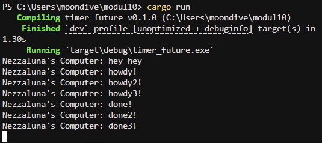
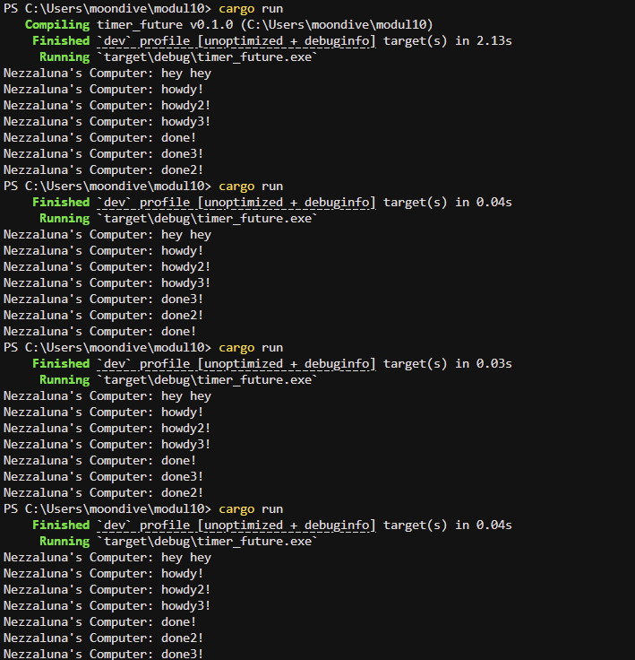

# Modul 10 Asynchronous Programming

## Reflection 1.2.

Saat menambahkan println! setelah spawner.spawn, teks tersebut akan tercetak di sebelum pesan dari dalam blok async ("howdy!" dan "done!") karena asynchronus programming memungkinkan unit kerja berjalan secara terpisah dari thread aplikasi utama. Hal ini terjadi karena Futures di Rust bersifat lazy dan tidak akan melakukan apa pun kecuali didorong secara aktif hingga selesai oleh sebuah executor. Dalam program ini, fungsi spawner.spawn hanya bertugas wrap future ke dalam sebuah Task dan mengirimkannya ke dalam antrean (ready_queue) melalui channel, namun tidak langsung mengeksekusinya. Karena executor baru benar-benar mulai memproses antrean dan memanggil fungsi poll pada tugas-tugas tersebut saat perintah executor.run() dijalankan, instruksi synchronous yang ada di thread utama akan selesai dieksekusi lebih dulu sebelum tugas asynchronous yang baru saja didaftarkan sempat berjalan.

## Reflection 1.3.

1. What is the effect of spawning?  
   Spawning adalah proses pembuatan unit kerja yang berjalan secara terpisah dari thread utama aplikasi untuk mencapai pemrograman concurrent. Dalam Rust, melakukan spawn pada sebuah task memungkinkan tugas tersebut dijalankan secara bersamaan tanpa perlu membuat thread tambahan, dimana future akan di wrap ke dalam struktur task dan dimasukkan ke dalam antrean. Efeknya adalah tugas tersebut terjadwal untuk dieksekusi, namun tetap bersifat lazy dan tidak akan benar-benar berjalan sampai ada executor yang mendorongnya hingga selesai.

2. What is the spawner for, what is the executor for, what is the drop for?  
   Masing-masing komponen memiliki peran mekanis yang spesifik, spawner berfungsi untuk membuat future baru dan mengirimkannya ke saluran tugas (task channel), bertindak sebagai titik masuk bagi pekerjaan baru, executor berfungsi sebagai mesin yang menarik tugas-tugas tersebut dari saluran dan menjalankannya dengan memanggil fungsi poll setiap kali tugas tersebut siap untuk diproses, dan fungsi drop digunakan untuk menutup ujung pengirim pada saluran, memberikan sinyal kepada executor bahwa tidak ada lagi tugas yang akan dikirimkan. Apabila tidak melakukan drop pada spawner, executor akan tetap dalam kondisi menunggu selamanya, mengharapkan adanya tugas baru bahkan setelah tugas-tugas awal telah selesai.

3. What is the correlation of all of that?  
   Komponen-komponen ini berkorelasi melalui hubungan producer-consumer yang berpusat pada saluran komunikasi (channel). Spawner (producer) memasukkan tugas ke dalam saluran, sementara executor (consumer) menunggu tugas tiba untuk dieksekusi secara efisien tanpa harus memblokir seluruh thread untuk satu tugas yang sedang menunggu. Perintah drop berfungsi sebagai pemutus siklus hidup hubungan ini, dengan memastikan bahwa executor mengetahui kapan tugasnya benar-benar berakhir sehingga program dapat keluar dari loop run() dengan bersih setelah antrean tugas kosong.

### Remove Spawn

### Add Back Spawn

Berdasarkan hasil eksekusi pada screeshoot di atas, multiple spawn memungkinkan beberapa future berjalan secara concurrent, dimana urutan selesainya tugas ("done!", "done2!", dan "done3!") dapat bervariasi karena tergantung pada kapan masing-masing future tersebut dipoll oleh executor untuk membuat kemajuan. Pesan "hey hey" tetap muncul paling awal karena proses spawning bersifat asynchronus dan tidak memblokir thread utama aplikasi. Sedangkan, penghapusan perintah drop(spawner) menyebabkan program mengalami hang atau tidak pernah selesai (terlihat bahwa prompt terminal tidak muncul kembali), karena executor akan terus menunggu kiriman tugas baru dari saluran (channel) yang dianggap masih terbuka selama spawner belum dihentikan secara eksplisit. Penutupan spawner penting agar executor mengetahui bahwa tidak ada lagi tugas yang akan masuk dan dapat berhenti beroperasi setelah antrean tugas benar-benar kosong.
